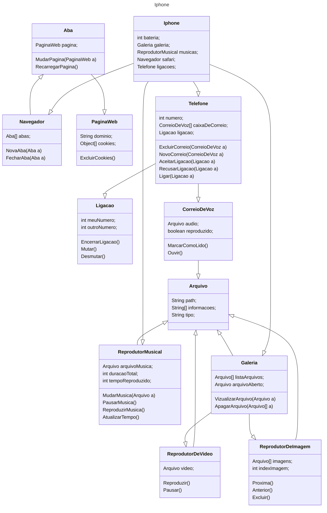

<h1>DIO - Trilha Java Básico  Desafio POO</h1>

<h3>Diagrama</h3>

```mermaid
---
title: Iphone
---
classDiagram
    Iphone --|> ReprodutorMusical
    Iphone --|> Galeria
    Arquivo <|-- Galeria
    Arquivo <|-- ReprodutorDeVideo
    Arquivo <|-- ReprodutorDeImagem
    Arquivo <|-- ReprodutorMusical
    Galeria --|> ReprodutorDeVideo
    Galeria --|> ReprodutorDeImagem
    Iphone --|> Navegador
    Aba <|-- Navegador
    Aba --|> PaginaWeb
    Iphone --|> Telefone
    Telefone --|> Ligacao
    Telefone --|> CorreioDeVoz
    CorreioDeVoz --|> Arquivo
    class Iphone{
        int bateria;
        Galeria galeria;
        ReprodutorMusical musicas;
        Navegador safari;
        Telefone ligacoes;
    }
    class Arquivo{
        String path;
        String[] informacoes;
        String tipo;
    }
    class ReprodutorMusical{
        Arquivo arquivoMusica;
        int duracaoTotal;
        int tempoReproduzido;
        MudarMusica(Arquivo a)
        PausarMusica()
        ReproduzirMusica()
        AtualizarTempo()
    }
    class Galeria{
        Arquivo[] listaArquivos;
        Arquivo arquivoAberto;
        VizualizarArquivo(Arquivo a)
        ApagarArquivo(Arquivo[] a)
    }
    class ReprodutorDeVideo{
        Arquivo video;
        Reproduzir()
        Pausar()
    }
    class ReprodutorDeImagem{
        Arquivo[] imagens;
        int indexImagem;
        Proxima()
        Anterior()
        Excluir()
    }
    class Navegador{
        Aba[] abas;
        NovaAba(Aba a)
        FecharAba(Aba a)
    }
    class Aba{
        PaginaWeb pagina;
        MudarPagina(PaginaWeb a)
        RecarregarPagina()
    }
    class PaginaWeb{
        String dominio;
        Object[] cookies;
        ExcluirCookies()
    }
    class Telefone{
        int numero;
        CorreioDeVoz[] caixaDeCorreio;
        Ligacao ligacao;
        ExcluirCorreio(CorreioDeVoz a)
        NovoCorreio(CorreioDeVoz a)
        AceitarLigacao(Ligacao a)
        RecusarLigacao(Ligacao a)
        Ligar(Ligacao a)
    }
    class Ligacao{
        int meuNumero;
        int outroNumero;
        EncerrarLigacao()
        Mutar()
        Desmutar()
    }
    class CorreioDeVoz{
        Arquivo audio;
        boolean reproduzido;
        MarcarComoLido()
        Ouvir()
    }
```